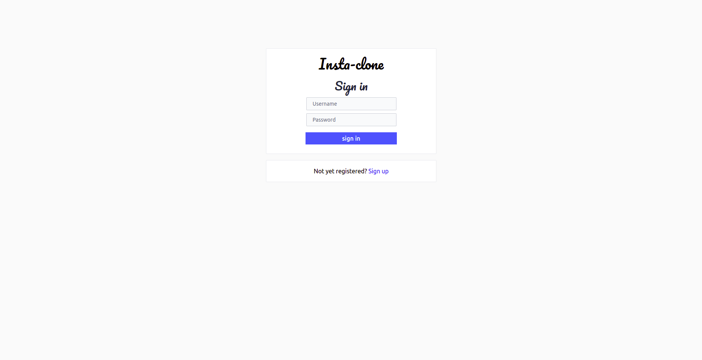
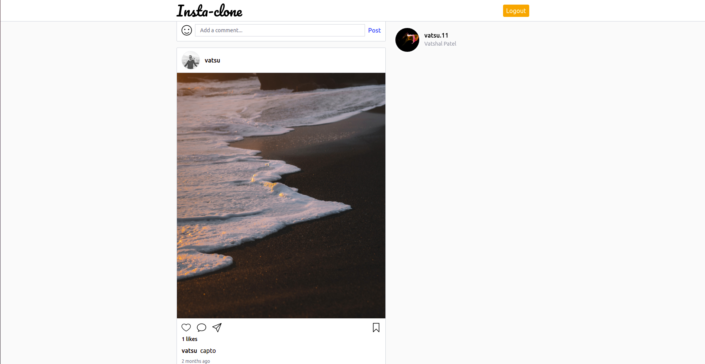

# insta_clone

## TechStack:
1. Reactjs 
2. Nodejs 
3. Redux 
4. Mongodb
5. Express

## Functionalities implemented till now:
1. Authentication and Authorization using JWT
2. Display user profile along with all the posts of that user
3. Like functionality for post
4. Comment functionality for post

## Some snapshots of the webapp:
### Sign in page:

### Home Page:

### User Profile page:

